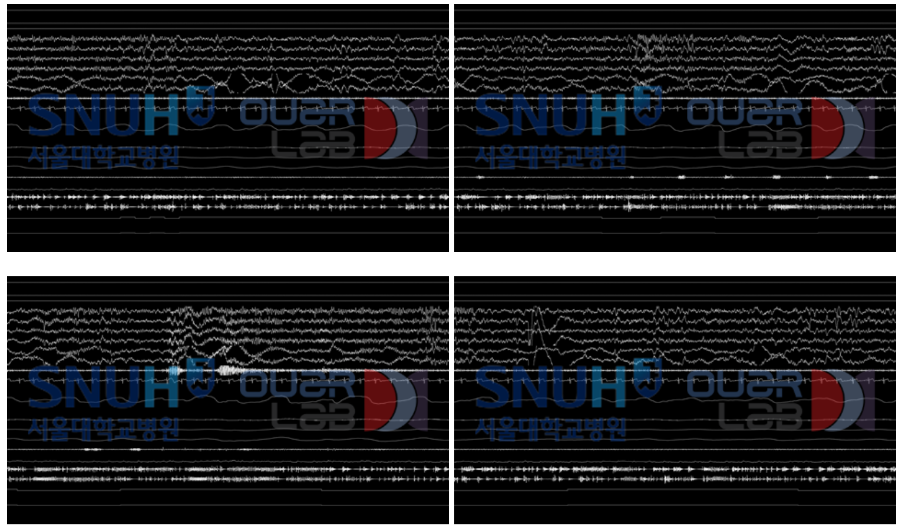

# Sleep AI Challenge

Project 기간: 2021년 2월 1일 → 2021년 2월 7일

[MAIC](https://maic.or.kr/competitions/3/infomation)

[AI-Challange/Sleep](https://github.com/AI-Challange/Sleep)

# Overview

## Sleep AI Challenge

- 수면 데이터는 인생의 1/3을 차지하는 주요 라이프 로그 데이터
- 수면다원검사는 대상자가 수면을 취하며 뇌파, 심전도, 호흡 등의 생체 신호를 측정하는 검사
- 수면기사 또는 수면전문의는 측정된 여러 신호들을 종합적으로 분석해 수면단계 분류, 이상 호흡 검출, 움직임 및 각성 검출 등을 판독
- 이를 통해 수면무호흡증, 기면병, 렘수면 장애 등 수면과 관련된 여러 질환을 진단
- 수면다원검사 이미지 데이터를 기반으로 각 이미지의 수면단계(Wake, N1, N2, N3, REM) 분류
- 최종 6등

# Dataset



```
이미지에는 아래의 순서대로(상단부터 하단으로) 신호가 포함되어 있음 
 └ X Axis, Y Axis, Z Axis, C3-M2, C4-M1, O1-M2, O2-M1, E1-M2, E2-M1, Chin EMG, ECG, Flow, Thermistor, Thorax, Abdomen, Snore, Audio Volume, Left Leg EMG, Right Leg EMG, SpO2(85%~100%), SpO2(40~100%)
 └ 각 신호가 차지하는 높이(Pixel) 아래 표 참고
 └ 원본 이미지는 1080이나 270으로 Resize 되어 제공됨, 이에 따라 높이(Pixel)는 다소 오차가 있을 수 있음
 └ 각 그룹 내의 Signal은 서로의 영역을 침범 할 수 있음, 다른 그룹의 Signal은 서로의 영역을 침범 할 수 없음
 ** 참고 : Sample_crop.zip file - 제시된 pixel을 기반으로 각 Signal, Group 별로 Crop
- 1건의 검사결과는 약 6시간에 대한 검사 결과이며, 30초 단위의 데이터가 1장의 이미지로 변환 됨.
- 각 검사 결과는 평균 731.4장의 이미지를 보유하고 있음 (약 6시간)
- 데이터의 시간 순서는 이미지명으로 정렬되어 있음 : 예시 > 검사결과 코드_0001.png 검사결과 코드_0002.png, ...
- 각 이미지는 순서에 따라 연속적인 데이터임
- 검사 초기 일부는 수면이 시작되지 않아 레이블이 없음 : 예시 > 검사결과-1은 0004.png 부터 label이 존재
- Train/Validation Dataset : 800건(명), Label 공개  // Test Dataset : 200건(명), Label 비공개
```

# Method

- (1080,480)으로 resize하여 group을 기준으로 (3,387,480)으로 reshape
- 학습결과 overfitting이 일어나 특정 feature에 너무 overfitting이 된다고 생각
- augmentation으로 feature를 random drop(k=2)해주는 방법을 사용
- random drop으로 인한 성능 향상 확인
- 추후 image size(3,100,480)를 작게하여 여러가지 setting(learning rate, wegiht decay, drop 개수, model)에 대해서 실험
- 결과적으로 large input size일 때 성능이 좋았으나 시간이 부족하여 다른 모델(base : resnet18)에서 실험을 진행 못함
- large inpurt size에서 efficientnet이나 resnet50으로 학습했을 때 성능이 향상되었을 것으로 예상

# 평가 기준

## 정량 평가

F1 Macro Metric → 각 class의 F1 score

$$Macro-F1 = \frac1N \sum_{k=1}^NF1-score_k$$

## 정성 평가

개발 문서 ppt를 기반으로 한 발표 평가
